# 100 DAYS OF MACHINE LEARNING
___

This repo consists of my whole 100 days of learning journey and in this file I will be documenting this complete journey !! Let's go !!
___
## Syllabus to cover
This is just a pre-setup and things are added as exploration continues !!

| **S.N.** | **Books and Lessons (Resources)**                                                                                                 | **Status** |
|----------|-----------------------------------------------------------------------------------------------------------------------------------|------------| 
| **1.**   | [**Hands-On Machine Learning with Scikit-Learn, Keras, and TensorFlow**](https://github.com/ageron/handson-ml3)                   | ⏳          |
| **2.**   | [**Machine Learning Scientist With Python**](https://app.datacamp.com/learn/career-tracks/machine-learning-scientist-with-python) | ⏳          |

___

## Projects

| **S.N.** | **Project Title**                                                                                                                                                                                | **Status** |
|----------|--------------------------------------------------------------------------------------------------------------------------------------------------------------------------------------------------|------------|
| 1.       | [**California Housing Price Prediction**](https://github.com/iamshishirbhattarai/Machine-Learning/blob/main/California%20Housing%20Price%20Prediction/California_housing_price_prediction.ipynb) | ✅          |
 | 2.       | [**Iris Flower Classification**](https://github.com/iamshishirbhattarai/Machine-Learning/tree/main/Iris%20Flower%20Classification)                                                               | ✅          |
## Topics Learnt Every Day

| **Days**        | **Learnt Topics**                                                                                                          | **Resources used**                                                                                                                                                                                                                                  |
|-----------------|----------------------------------------------------------------------------------------------------------------------------|-----------------------------------------------------------------------------------------------------------------------------------------------------------------------------------------------------------------------------------------------------|
| [Day 1](Day1)   | EDA, Splitting with random & stratified sampling, correlations                                                             | [Hands-On Machine Learning with Scikit-Learn, Keras, and TensorFlow](https://github.com/ageron/handson-ml3)                                                                                                                                         |
 | [Day 2](Day2)   | Imputation, Estimators, Transformers, Predictors, get_dummies vs OneHotEncoder                                             | [Hands-On Machine Learning with Scikit-Learn, Keras, and TensorFlow](https://github.com/ageron/handson-ml3)                                                                                                                                         |
 | [Day 3](Day3)   | Feature Scaling, Custom Transformers, Pipelines, ColumnTransformers                                                        | [Hands-On Machine Learning with Scikit-Learn, Keras, and TensorFlow](https://github.com/ageron/handson-ml3)                                                                                                                                         |
 | [Day 4](Day4)   | Training and Selecting Model, Evaluating Model, Fine Tuning The Model                                                      | [Hands-On Machine Learning with Scikit-Learn, Keras, and TensorFlow](https://github.com/ageron/handson-ml3)                                                                                                                                         |
  | [Day 5](Day5)   | Fine Tuning Decision Tree & Random Forest, Lasso Regression                                                                | [Machine Learning Scientist With Python](https://app.datacamp.com/learn/career-tracks/machine-learning-scientist-with-python)                                                                                                                       |
  | [Day 6](Day6)   | Gradient Descent Algorithm, Polynomial Regression, Ridge Vs. Lasso, Elastic Net Regression                                 | [Hands-On Machine Learning with Scikit-Learn, Keras, and TensorFlow](https://github.com/ageron/handson-ml3)                                                                                                                                         |
| [Day 7](Day7)   | Logistic Regression, Softmax Regression, Soft Margin Classification, Support Vector Machines, SVM Kernels                  | [Hands-On Machine Learning with Scikit-Learn, Keras, and TensorFlow](https://github.com/ageron/handson-ml3) <br><br> [StatQuest with Josh Starmer](https://www.youtube.com/watch?v=efR1C6CvhmE)                                                     |
 | [Day 8](Day8)   | SVM Code Implementation, Decision Tree, Hyperparameter Tuning                                                              | [Hands-On Machine Learning with Scikit-Learn, Keras, and TensorFlow](https://github.com/ageron/handson-ml3)                                                                                                                                         |
 | [Day 9](Day9)   | Ensemble learning Intro, Voting Classifiers and its types, Bagging, Pasting & Random Forest, Boosting, AdaBoost            | [Hands-On Machine Learning with Scikit-Learn, Keras, and TensorFlow](https://github.com/ageron/handson-ml3)                                                                                                                                         |
  | [Day 10](Day10) | Gradient Boosting, Learning rate and number of estimator, Stacking                                                         | [Hands-On Machine Learning with Scikit-Learn, Keras, and TensorFlow](https://github.com/ageron/handson-ml3)                                                                                                                                         | 
  | [Day 11](Day11) | XGBoost introduction, Regularization, Fine Tuning, Pipeines, Tuning using pipelines                                        | [Machine Learning Scientist With Python](https://app.datacamp.com/learn/career-tracks/machine-learning-scientist-with-python)                                                                                                                       |
  | [Day 12](Day12) | Curse of dimensionality, Approaches of dimensionality reduction, PCA, Dimensionality reduction & reconstruction            | [Hands-On Machine Learning with Scikit-Learn, Keras, and TensorFlow](https://github.com/ageron/handson-ml3)                                                                                                                                         |
  | [Day 13](Day13) | Feature selection, Feature Extraction, Compression & Decompression using PCA, Variance Threshold, Elbow Mehhod             | [Hands-On Machine Learning with Scikit-Learn, Keras, and TensorFlow](https://github.com/ageron/handson-ml3) <br> <br> [Machine Learning Scientist With Python](https://app.datacamp.com/learn/career-tracks/machine-learning-scientist-with-python) | 
   | [Day 14](Day14) | Initiated a project and prepared a rough notebook (Included many learnt topics)                                            | Self-Compiled-Notes                                                                                                                                                                                                                                 |
   | [Day 15](Day15) | Learnt Deployment using Flask and deployed yesterday's project                                                             | [Youtube](https://www.youtube.com/watch?v=MxJnR1DMmsY&t=838s)                                                                                                                                                                                       |
   | [Day 16](Day16) | Unsupervised Learning, Applications, Clustering, K-means                                                                   | [Hands-On Machine Learning with Scikit-Learn, Keras, and TensorFlow](https://github.com/ageron/handson-ml3)                                                                                                                                         |
   | [Day 17](Day17) | Hierarchical clustering Implementations, Dendrograms and Limitations, K-means Implementation, Elbow-method And Limitations | [Machine Learning Scientist With Python](https://app.datacamp.com/learn/career-tracks/machine-learning-scientist-with-python)                                                                                                                       |
   | [Day 18](Day18) | Silhouette Coefficient, Document Clustering, Image Segmentation Using Kmeans                                               | [Hands-On Machine Learning with Scikit-Learn, Keras, and TensorFlow](https://github.com/ageron/handson-ml3) <br> <br> [Machine Learning Scientist With Python](https://app.datacamp.com/learn/career-tracks/machine-learning-scientist-with-python) |
   


  
___
## Day 1 

### California Housing Price Prediction
Today I started to actually create my notebook on 'California housing price prediction' : a project from the book 'Hands-On Machine Learning with Scikit-Learn, Keras, and Tensorflow'.
The tasks I performed and learnt are listed below:

- Loaded the dataset.
<br> <br>
- Observed dataset distribution. <br> <br>
  


- Split the dataset into training and testing set using both 
 random and stratified sampling.  <br>
    <br>
    1. **Random Sampling :** 
            It is a technique of selecting subset of datas from large dataset in such
  a way that there is an equal chance of each points to be selected. This method doesn't
  introduce any kind of biases.
<br> <br>
  2. **Stratified Sampling :** 
            It is a technique that is used when we have to deal with imbalanced
  datasets where some datasets are under-presented. It works by providing the
  equal proportion of target variable 'y' of each class in both training and testing sets.
  <br> <br>
- Observed the geographical_distribution. Here, the
  size of the points determines the size of *population* and color represents
  the *median_house_value*. <br> <br>
 
- Studied correlations among different variables and found out that the 
*median_income* has good correlation with *median_house_value*. <br>  
     

___

## Day 2

### Continuing California Housing Price Prediction

I continued the ongoing project i.e. **California Housing Price Prediction** and got to apply some exciting stuffs that I
have learnt. Key learnings and tasks performed are listed below:
<br> <br>
- Experimented with various attributes combinations.
    ``` python
    #Finding room per house
    housing['room_per_house'] = housing['total_rooms'] / housing['households']
    #Finding bedrooms_ratio 
    housing['bedrooms_ratio'] = housing['total_bedrooms'] / housing['total_rooms']
    #Finding people_per_house
    housing['people_per_house'] = housing['population'] / housing['households'] 
    ```
- Performed **Imputation** on missing datas using **median** strategy and converted transformed dataset to a DataFrame
   <br> <br> **Imputation**: It is the process of setting null values to some values such as zero, the mean, the median,
etc. I used Scikit-learn's class **SimpleImputer** and applied **median** strategy. The code snippet is as follows:
    ``` python
    from sklearn.impute import SimpleImputer
    imputer = SimpleImputer(strategy = "median")
    
    #Separating numerical-valued attributes as housing_num
    housing_num = housing.select_dtypes(include = [np.number])
    imputer.fit(housing_num)
    X = imputer.transform(housing_num)
    #Converting X into a dataframe
    housing_tr = pd.DataFrame(X, columns = housing_num.columns,
                              index = housing_num.index)
    ```
- Learnt about some frequently used terminologies **estimators**, **transformers** and **predictors** in Scikit Learn.
    <br> <br> 
        **i. Estimators :** Any object that estimates some parameters on the basis of dataset is an estimator. It is
    performed by *fit()* function. **SimpleImputer** is an example of estimator. <br> <br>
        **ii. Transformers :** Any object that is capable to transform the dataset is a transformer. It uses 
    *tranform()* function. **SimpleImputer** is also a transformer. Both estimation & transform can be done at once by
    using *fit_transform()* method. <br> <br>
        **iii. Predictors :** The estimator capable of making predictions with a dataset given is a predictor. 
    **LinearRegression* is a predictor which uses **predict()** function to make predictions. <br> <br>
- Understood the differences in using *get_dummies* from *pandas* and *OneHotEncoder* from *Scikit-Learn*
   <br> <br> 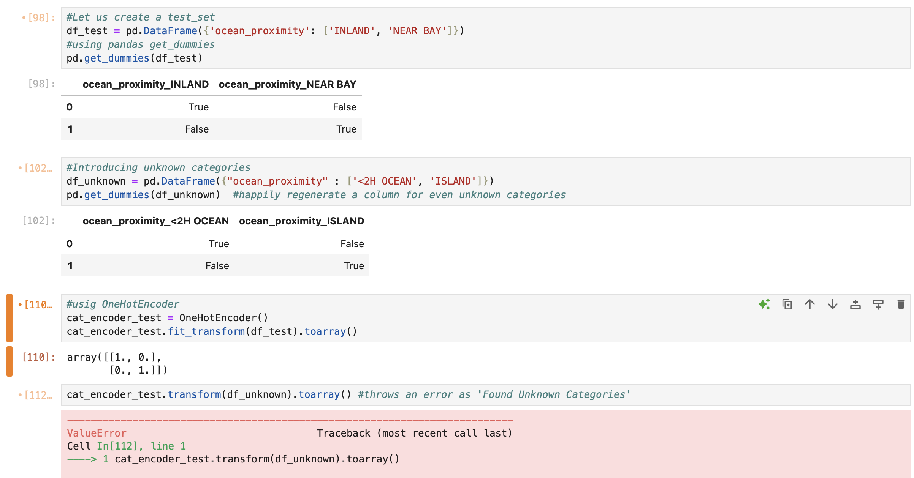
        <br> 
   *OneHotEncoder* remembers which categories it was trained on while *get_dummies* doesn't remember. As shown in above
screenshot of notebook where both were trained on same datas. In case of pandas, when dataset with unknown categories
was asked to transform, it happily regenerated column for even unknown categories while *OneHotEncoder* throws error !!

___

## Day 3
### Continued California Housing Price Prediction

Today I learnt a very crucial step in Machine Learning i.e. **Feature Scaling And Transformation**. Below are few
summarization of my learnings and performed tasks:

- Performed two types of scaling: <br> <br>**i. Min-Max Scaling :** For this scaling I used *Scikit-Learn* 's *MinMaxScaler* class. This is the simplest
scaling method that is performed by subtracting the min value and dividing by the difference of the min and the max.

    ```python
    from sklearn.preprocessing import MinMaxScaler
    
    min_max_scaler = MinMaxScaler(feature_range = (-1,1))
    housing_min_max_scaled = min_max_scaler.fit_transform(housing_num) 
   ```

    **ii. Standarization :** For this scaling I used *Scikit-Learn* 's *StandardScaler* class. It is performed by subtracting
with mean and dividing by the standard deviation.

    ```python
    from sklearn.preprocessing import StandardScaler
    
    std_scaler = StandardScaler()
    housing_num_std_scaled = std_scaler.fit_transform(housing_num)
    ```


- Learnt about transforming target values. When we transform target values, it is very necessary to inverse the 
transformation while providing the predicted values. Suppose we replaced the target value with it's logarithm, the
output will also be in logarithm. So, for this I can use *inverse_transform()* method from Scikit's Learn. But, rather
I chose a simpler option and decided to use *TransformedTargetRegressor* that simply provides the output by inversing
the transform. 

    ```python
    #Using TransformedTargetRegressor
    from sklearn.compose import TransformedTargetRegressor
    from sklearn.linear_model import LinearRegression
    
    model = TransformedTargetRegressor(LinearRegression(), transformer = StandardScaler())
    model.fit(housing[["median_income"]], housing_labels)
    some_new_data = housing[["median_income"]].iloc[:5]
    predictions = model.predict(some_new_data)
    ```
- Learnt to make simple **custom transformer**. Here, I simply transformed the *population* as logarithm of *population*
and visualize the original and logarithmic population to see the changes in distribution of the data.    
    ```python
    #Applying logarithmic transformation in population as the datas are skewed
    from sklearn.preprocessing import FunctionTransformer
    
    log_transformer = FunctionTransformer(np.log, inverse_func = np.exp)
    log_pop = log_transformer.transform(housing['population'])
    fig, ax = plt.subplots(nrows = 1, ncols = 2, figsize = (12,6))
    ax[0].hist(housing['population'], bins=50)
    ax[0].set_xlabel('Original Populaton')
    ax[1].hist(log_pop, bins=50)
    ax[1].set_xlabel('Log of Population')
    plt.savefig("log_population_vs_population.png", dpi = 300)
    plt.show()
    ```
  **Output :** <br><br>
  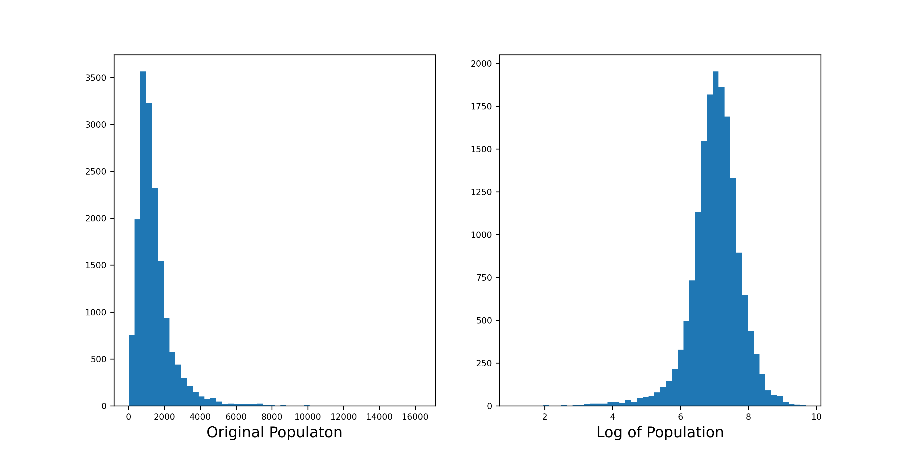  
<br> <br>
- Applied **pipelines** and **ColumnTransformers** 
<br> <br>
**i. Pipelines :** It is simply a sequence of transformations. For this, we can use *Pipeline* or *make_pipeline* class
from *Scikit-Learn*. If we prefer *Pipeline* we need to provide name/estimators pairs defining a sequence of steps, while
in *make_pipeline* we can simply provide estimators. <br> <br>
**Pipeline Implementation Code :**
    ```python
    from sklearn.pipeline import Pipeline
    num_pipeline = Pipeline([
       ("impute", SimpleImputer(strategy="median")),
       ("standardize", StandardScaler()),
    ])
   ```

    **make_pipeline Implementation Code:**
    ```python
    from sklearn.pipeline import make_pipeline
    num_pipeline = make_pipeline(SimpleImputer(strategy="median"), StandardScaler())
    ```
  
    **ii. ColumnTransformers :** The *ColumnTransformer* in *scikit-learn* is a powerful tool that allows you to apply 
different preprocessing pipelines to different subsets of features within your dataset. This is particularly useful
when you have a mix of numerical, categorical, and other types of data that require different transformations.
We have **ColumnTransformer** and **make_column_transformer** and the difference is same as in pipelines i.e.
**make_column_transformer** doesn't need naming. <br> <br>
**ColumnTransformer Implementation Code :**
    ```python
    from sklearn.compose import ColumnTransformer
    num_attribs = ["longitude", "latitude", "housing_median_age", "total_rooms",
                  "total_bedrooms", "population", "households", "median_income"]
    cat_attribs = ["ocean_proximity"]
    cat_pipeline = make_pipeline(
       SimpleImputer(strategy="most_frequent"),
       OneHotEncoder(handle_unknown="ignore"))
    preprocessing = ColumnTransformer([
       ("num", num_pipeline, num_attribs),
       ("cat", cat_pipeline, cat_attribs),
    ])
    ```
  **make_column_transformer Implementation Code :**
    ```python
  from sklearn.compose import make_column_selector, make_column_transformer
  preprocessing = make_column_transformer(
     (num_pipeline, make_column_selector(dtype_include=np.number)),
     (cat_pipeline, make_column_selector(dtype_include=object)),
  )
  ```
  Here, *make_column_selector* is used to select the specific type of features in the dataset. 


- Applied almost all the transformations that we did before with the help of pipelines and column transformers with the code screenshot
attached below: <br> <br>


___

## Day 4
### Completed 'California Housing Price Prediction'

Today I worked on selecting and training model as well as fine tuning the best model so far to optimize the performance.
Below are some of my learnings and understandings : <br> <br>
- Trained the model using LinearRegression, DecisionTreeRegressor and RandomForestRegressor. LinearRegression doesn't 
work fine on training set, DecisionTreeRegressor worked absolutely fine on training set but failed on Cross-Validation, 
but RandomForestRegressor worked fine on training set and comparatively better on Cross-Validation.
    <br> <br>
    

- Fine tuned the model using both Grid search and Randomized Search. Randomized Search worked properly compared to Grid
Search. Screenshot of the notebook are attached below:
<br> <br>
    
    <br> <br> 


- Chose the *rand_search* as the *final_model* and evaluated the model using test set and found out it worked better than
with cross-validation. <br> <br>
    

I had already learnt all of these techniques but haven't ever applied on any projects. So, this project was a great
start to implement my learning practically.

___

## Day 5

Today I thought of continuing the course that I had started prior to this challenge. The course is within the track
**'Machine Learning Scientist With Python'** from **DataCamp**. So, I completed the **"Machine Learning with Tree-Based Models in Python"**
course and also did a course-based-project where I was asked to build models and find the best model for predicting the
movie rental durations. I applied almost the same concepts and techniques as yesterday. Additional to them, I performed
LASSO regression. LASSO regression is used for regularization of a model to prevent overfitting. Few of the snapshots of
today task are provided below:

- **Dataset Preparation and Splitting :** <br> <br>
     <br> <br>
- **Building and Selection of the best model :** <br> <Br>
 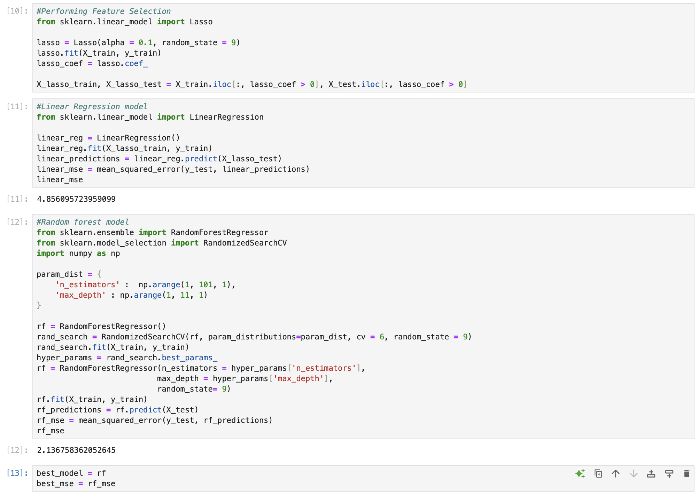

___

## Day 6

Today I started reading Chapter-4: **Training models** of **Hands-On Machine Learning** book. I learnt the following
things:

- I got to revised about Linear Regression model and Gradient Descent Algorithm. Gradient Descent Algorithm is a generic
algorithm which is capable of finding optimal solution from a wide range of problems. I had already learnt this and created
a notebook on this which you can visit by clicking here : [**Gradient Descent Notebook**](https://github.com/iamshishirbhattarai/Machine-Learning/tree/main/Gradient%20Descent%20Algorithm)
<br> <br>
- Additional to the pure Gradient Descent, I also read about *Batch Gradient Descent* that performs calculations over
full training set in every epoch. <br>The next type is *Stochastic Gradient Descent* that picks a random instance in the 
training set and computes the gradient based on the single instance.<br> There is a *Mini-Batch Gradient Descent* that
takes a set of instances randomly and computes the gradient.
<br> <br>
- Learnt to implement **Polynomial Regression** as follows:
   ```python
  #Data generation
  import numpy as np
  
  np.random.seed(42)
  m = 100
  X = 6 * np.random.rand(m, 1) - 3 
  y = 0.5 * X ** 2 + X + 2 + np.random.randn(m, 1)
  
  #Visualizing the datas
  import matplotlib.pyplot as plt

   plt.plot(X, y, "b.")
   plt.xlabel("X")
   plt.ylabel("y")
   plt.grid()
   plt.show()
  ```
  
    

  ```python
  #polynomial regression using scikit-learn
  from sklearn.preprocessing import PolynomialFeatures
  from sklearn.linear_model import LinearRegression
  poly_features = PolynomialFeatures(degree = 2, include_bias = False)
  X_poly = poly_features.fit_transform(X)
  lin_reg = LinearRegression()
  lin_reg.fit(X_poly, y)
  
  #Trying with new datas
  X_new = np.linspace(-3, 3, 100).reshape(100, 1)
  X_new_poly = poly_features.transform(X_new)
  y_new = lin_reg.predict(X_new_poly)

  plt.plot(X, y, "b.")
  plt.plot(X_new, y_new, "r-", linewidth = 2, label="Predictions")
  plt.xlabel("X")
  plt.ylabel("Y", rotation = 0)
  plt.legend() 
  plt.show()
  ```
   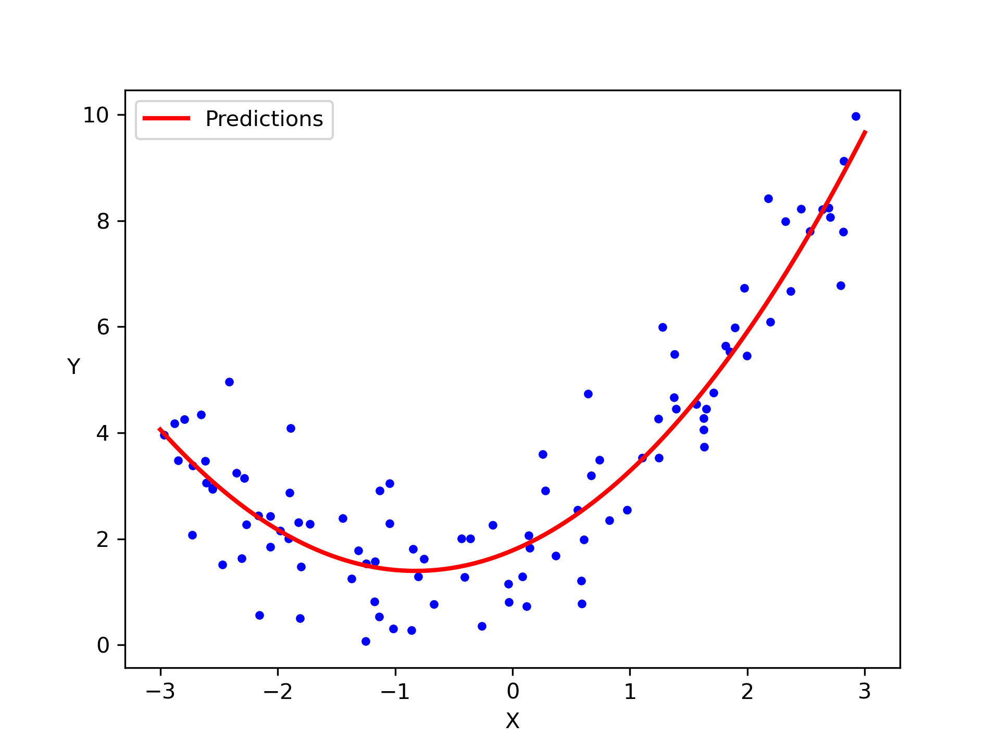  
<br> <br>
- I deeply understood about Regularization models today. The regularization is the process of encouraging the learning
algorithms to shrink the values of the parameter to avoid overfitting during training. The three regularization models
are explained below: <br> <br>
**i. Ridge Regression :** It is the type of regularization model which is used when most of the variables are useful.
     The function minimizes: <br><br>
 **Sum of the squared residuals + lambda * weight ^ 2** <br> <br>

    **ii. Lasso Regression :** It is the type of regularization model which is used when we have to exclude some useless 
variable i.e. it is capable of excluding useless variable from equations.
 <br>
 The function minimizes: <br><br>
 **Sum of the squared residuals + lambda *  |weight|**
    <br> <br>
   **iii. Elastic Net Regression :** It is a middle ground between the Ridge and Lasso Regression. The regularization 
term is a weighted sum of both ridge and lasso's regularization term, controlled with the mix ratio *r*.
  <br>
 The function minimizes: <br> <br>
 **Sum of the squared residuals + r * lambda * |weight| + (1-r) * lambda * weight ^ 2**

___
 
## Day 7

I finished the chapter 4 about **Training Models** from the book and started reading the next chapter which is about 
**Support Vector Machines (SVM)**. In the remaining portion of the chapter 4, there was about **Logistic Regression** 
and **Softmax Regression** where both are used for classification problem. Presenting my readings with following points:

- **Logistic Regression** is a type of regression algorithm that are used for binary classification problem. It uses 
*Sigmoid Function* and provides the output between 0 and 1. There is a decision boundary set which impacts the output of
the model. It can be implemented using **LogisticRegression** class in Scikit-Learn as follows:
   ```python
   from sklearn.linear_model import LogisticRegression
   from sklearn.model_selection import train_test_split
   from sklearn.metrics import accuracy_score
  
   X = iris.data[["petal width (cm)"]].values
   y = iris.target_names[iris.target] == 'virginica'
   X_train, X_test, y_train, y_test = train_test_split(X, y, random_state = 42)
   log_reg = LogisticRegression()
   log_reg.fit(X_train, y_train)
   y_pred = log_reg.predict(X_test)
   score = accuracy_score(y_test, y_pred) 
   ```
- **Softmax Regression** is a type of regression algorithm that is used for more than two classes or in general used for 
multiclass problem. This algorithm computes its respective output of each class and decides the class with higher score.
In Scikit-Learn, **LogisticRegression** class works as **Softmax** whenever multiple class is provided.

    ```pyton
     X = iris.data[["petal length (cm)", "petal width (cm)"]].values
     y = iris["target"]
     X_train, X_test, y_train, y_test = train_test_split(X, y, random_state = 42)

     softmax_reg = LogisticRegression(C=30, random_state = 42) #C is the hyperparameter
     softmax_reg.fit(X_train, y_train)
    ```
- **Soft Margin Classifier** also known as Support vector Classifier that allows flexibility in model by allowing some 
mis-classification when the datas are not perfectly separable. In contrast to this, **Hard Margin Classifier** is a 
strict classifier that tries to perfectly separate the datas to their belonging classes.
<br> <br>
- **Support Vector Machine** is used for both classification and regression. The main objective of SVM is to find the 
optimal hyperplane in an N-dimensional space that can separate the data points in different classes in different feature
space. It starts with data in a relatively low dimension and then move datas into a higher dimension and ultimately finds
a support vector classifier that separates the higher dimensional data into classes. <br>
<br> It uses **Kernel Functions** to transform the data into higher dimension. Well, they don't actually do the transformation
rather only calculates the relationship between every pair of points as if they are in higher dimension. This technique
is know as **Kernel Trick** that helps by reducing computation.
<br> <br>
I learnt about two types of **Kernel Function** today. They're discussed below:
<br> <br>
    **i. Polynomial Kernel :** It systematically increases dimensions and relationships between each pairs of observations
are used to find a support vector classifier.
   <br> <br>
    **ii. Radial Kernel :** In simpler way, I understood this as that the closest observation have a lot of influence while
farther has relatively little influence on the classification. Whichever is closer. It finds the support vector classifier in
infinite dimensions.

___

## Day 8


Today I completed the current chapter about SVM and started reading the next chapter about Decision Trees. The stuffs I learnt are listed below:

- I saw few code implementations on SVM that I had learnt yesterday. Well there wasn't a proper implementation from scratch
given, so It was just like being familiar with the syntax of each classifier and regression. I will get back to this topic,
whenever I find opportunities to explore it in detail. Just a representative image of the non-linear classification performed
using SVM : <br> <br>
 
<br><br>

- I read (rather say revised) about Decision Trees. I have already seen lots of the portion while taking other
courses. I trained, learnt about how decision trees works and also regularized hyperparameters with the help of 
Grid search finding the optimized and the best parameters. Both classifications and regression problem can be solved
by using Decision Tree. However, the regularization in decision tree is very necessary. If not done, the decision tree is
prone to overfitting. I learnt about Gini INdex and Entropy; the approaches followed for dividing the tree. Additionally,
performed an exercise which was at the end of the chapter which you can visit clicking here: 
[Exercise_Notebook](Day8/decision_trees.ipynb)
<br> A graphical representation of the tree from the exercise is provide below:
<br> <br>
    


___

## Day 9

Today I started learning about **Ensemble Learning** from the book. Below are few summaries on what I learnt : 

- I first learnt about **Voting Classifier** which is one of the Ensemble learning methods. In this method, as defined by its
name, it provides the aggregate of all the classifiers used or provide the class as an output with maximum votes. It performs
better than individual classifier. There are two types of Voting Classifier. They are discussed below:
<br> <br>
    **i. Hard Voting Classifier** is a type of Voting Classifier that predicts the class with major votes. By default,
scikit learn's **VotingClassifier** class performs *hard voting*.
  <br> <br>
   
    <br> <br>
    **ii. Soft Voting Classifier** is a type of Voting Classifier that predicts the class with the highest class probability,
averaged over all the individual classifiers.In Scikit learn, we have to set voting as "soft" to enable soft voting as shown 
in the screenshot of notebook below:
   <br> <br>
    


- Got a solid concept on **Bagging**. **Bagging** stands for **Bootstrap Aggregating** and is an ensemble method that uses
same training algorithm for every predictors but train them on different subsets of the training set. When sampling is done
with replacement, the method is **Bagging**. If sampling is done without replacement, then it is called **Pasting**. I also
performed **Out-Of-Bag(OOB)** evaluation. A screenshot of a notebook for bagging is attached below: 
<br> <br>
   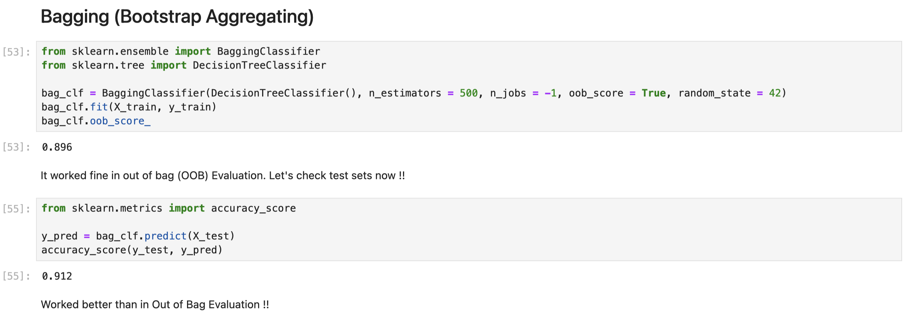
<br> <br>
- Performed **Random Forest** on the same dataset with the concept of bagging in the mind. It is also a type of bagging, but
it samples both training sets as well as features. I am implementing this from the very beginning of my journey so just 
attaching a screenshot down below: <br> <br>
    
<br> <br>
- Got familiar with **Boosting** concept. Boosting is also an ensemble learning method that trains predictors sequentially
, each trying to correct its predecessors. Well, there are many boosting mechanism, but today I just focused on
**AdaBoost**. <br> <Br>

- **AdaBoost** is a boosting algorithm that pays more attention to those training instances that predecessor underfits on.
An implementation sample :
 <br> <br>
    

___

## Day 10

Today I finished reading about **Ensemble Learning**. I got introduced to a new method known as **Stacking** while reading
this and also got a better chance to revise and know additional stuffs on **Gradient Boosting** too. Summaries of today's 
learnings are provided below: 

- Learnt about **Gradient Boosting**. **Gradient Boosting** is a type of boosting algorithm that works by performing sequential
correction of predecessor's error but do not tweak the weights of training instances as **AdaBoost** rather fits each predictor
using its predecessor's residual errors as labels/target. An implementation of how does it works and the direct implementation
through Scikit Learn's **GradientBoostingRegressor** can be found in the following screenshot:
<br> <br>

     <br> <br>
     <br> <br>

- **Learning Rate** in **Gradient Boosting** is one of the most important _hyperparamemter_. It is a number between 0 and 1 that
adjusts the shrinkage factor i.e. in general, controls how fast the model is learning. In another words, it determines 
the contribution of each tree in the final outcome. Decreasing the learning rate has to be compensated by
increasing the number of estimators in order for the ensemble to reach a certain performance i.e. there is a trade-off 
between **learning rate** and **no- of estimators**.
<br> <br>
- **Finding optimal number of trees** is one of the must done task while performing **Gradient Boosting**. We can use 
previously used fine tuning methods with **Grid Search** or **Random Search**. But, **Gradient Boosting** offers _n_iter_no_change_
hyperparameter that allows us to put integer values (say 8) that helps to automatically stop adding more trees if it observed that
the last 8 trees didn't help. <br> <br>
    
<br> <br>
- Got to know about another **Ensemble Learning** method : **Stacking**. It seems similar to the **Voting Classifier** but in this
learning, there is a model to perform the aggregation of the predictions. Such model is known as _blender_ or _meta learner_ and 
the model in which the original datasets are trained is known as base model. This was a great learning, and I performed the
same task that I did in **Voting Classifier** yesterday with **Stacking** and found working comparatively well. A screenshot
of the notebook is attached below: <br> <br>
    

___

## Day 11

Today I started a course within the **Machine Learning Scientist With Python** from  **DataCamp**. The course was
**Extreme Gradient Boosting with XGBoost**. So, today it was the day for **XGBoost**. Compiling my learnings in following
points:

- **XGBoost** is an optimized gradient-boosting machine learning library that provides greater speed and performance.
It is one of the most popular algorithm that has consistently outperformed single-algorithm methods. As compared to normal
gradient boosting that we performed yesterday, **XGBoost** is more scalable, has built in regularization, provides
parallelization, sophisticated tree-pruning and many other advanced features. A quick example of **XGBoost** implementation 
is shown below: <br> <br>
     <br> <br>

- Learnt about when to use **XGBoost** and when not to. It is used whenever there are large no. of training samples and has 
mixture of categorical and numerical features or just numerical features while it is not used in Image recognition,
computer vision, NLP and understanding problems and those problems with very few training samples.
<br> <br>
- Learnt about **Objective(Loss) Functions** and regularization in **XGBoost**.
<br> <br>
- Performed hyperparameter tuning using **Grid Search** and **Randomized Search**. Each has their own advantages and limitations.
A Quick example of **GridSearch** implementation is as follows: <br> <br>
    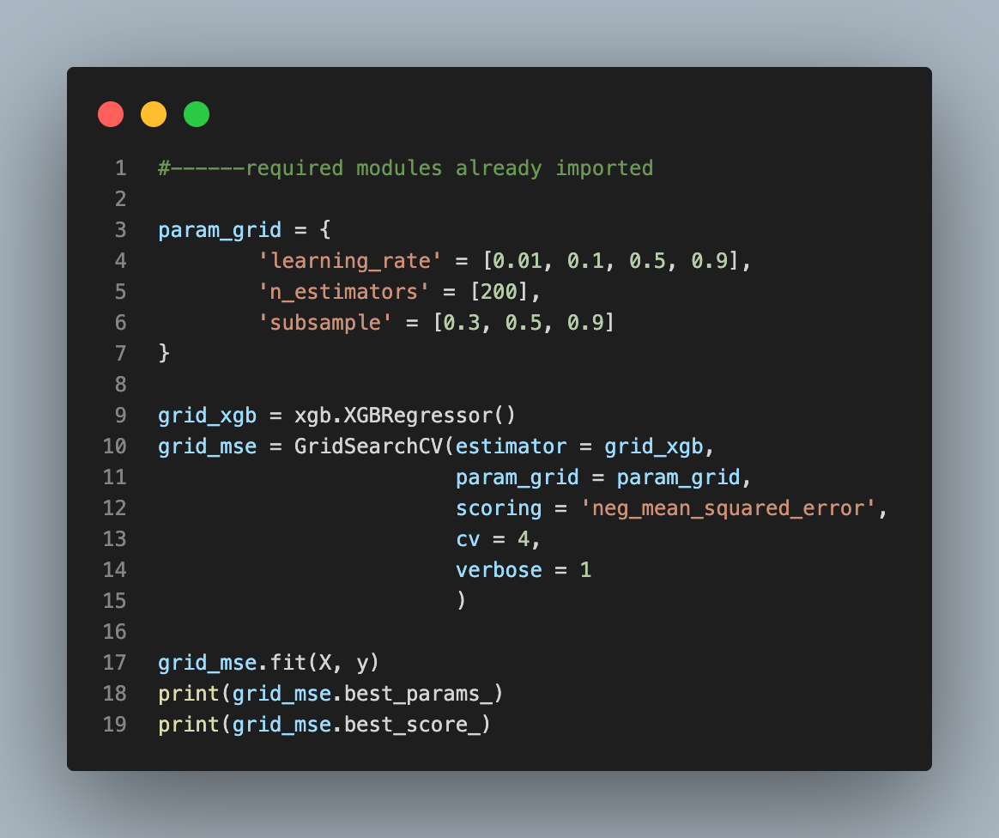
<br> <br>
- Performed **XGBoost** using pipeline and also tuned hyperparameters in pipeline. These are as similar as we previously 
performed while doing **California Housing Price Prediction** project. So, it was just a good revision. 
    
___

## Day 12

Today I started learning about **Dimensionality Reduction**. Let me compile my learnings in the following points:

- **Curse of Dimensionality**: Having very large no. of features for each training instances, makes not only training 
extremely slow but also make it much harder to find the solution. The problem is referred to as the **curse of dimensionality**
Also, the more dimensions the training set has, the greater the risk of overfitting is. So, these problems are often addressed
by **Dimensionality Reduction**.<br> <br>
- There are basically two approaches for dimensionality reduction: <br><br>
  **i. Projection :** It is an approach for dimensionality reduction that reduces the datas in higher dimensions to the lower
dimensions assuming that they can be represented linearly. <br> <br>
  **ii. Manifold Learning :** It is another approach for dimensionality reduction that represents the data in higher dimensions
to the lower dimensions. Unlike projection methods, manifold learning techniques are non-linear and aim to uncover the intrinsic
geometry(complex pattern or geometry that can't be represented by simple linear models) of the data. 
<br> <br>
- **PCA (Principal Component Analysis)** is the most popular dimensionality reduction algorithm that helps to reduce higher
dimension data into the lower (two or third) dimensions dataset. It follows **Projection** approach. There are various applications
of PCA. Nowadays, it is majorly used for **Visualization** of higher dimensions data in two or third dimensions to perform **EDA**.
Previously, it was also used for **Data Compression** and **Speeding up training of a supervised learning model** but nowadays since
we have advanced learning algorithm like **Neural Networks** we don't use it much for these purposes. The following figure demonstrates
a PCA operation : <br> <br>
    <br> <br>
- **PCA in Scikit Learn :** In Scikit-Learn, **PCA** can be implemented as follows: <br> <br>

    **Dimensionality Reduction** <br> <br>
     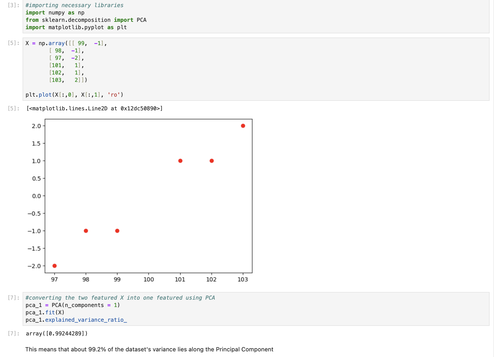 <br>
     Here, _explained_variance_ratio__ indicates how much % of the dataset's variance lies along the Principal Component.
    <br> <br>
    **Dimensionality Reconstruction** <br> <br>
    
    <br> <br>

___

## Day 13

I continued studying about **Dimensionality Reduction** from the book and also took and finished the course from **Datacamp**'s
track. Well, I learnt a lot of stuffs today. So, just summarizing in few point below:

- Learnt how we can perform **Feature Selection** from the datasets using various techniques. Some of the techniques may
involve the following: <br> <br>
  i. Removing the column if it has higher number of null values. <br> <br>
  ii. Removing highly correlated features as hardly new information is brought by highly correlated features. <br> <br>
      
  <br> <br> Here, _Buttock height_ and _Crotch height_ has higher correlation, so one can be dropped to reduce number of 
features. <br> <br> 
  iii. Using **Recursive Feature Elimination (RFE)** method using various estimators such as LogisticRegression, RandomForest
or can also combined these features and perform voting.
<br> <br>
- Performed **Feature Extraction** using **PCA** that I have mentioned yesterday also. But gone in little bit depth today.
I learnt about choosing the right number of dimensions or **Principal Component** selection. I used few methods as mentioned below:
<br> <br> 

    **i. Variance Threshold :** Providing the variance we want, we can get the dimensions reduction in the dataset. A screenshot
of implementation attached below: <br> <br>
         <br> <br>

    **ii. Random Search :** With the use of **Random Search** we can find the best no. of components as follows: <br> <br> 
         <br> <br>

    **iii. Elbow Method :** We can use elbow method to determine the number of components. For the figure below, we can
conclude that 3 _n_components_ would be fine. <br> <br> 
         <br> <br>

- Performed **Compression** using PCA. And, also decompressed the images. You can see both before and after compression
part of datasets as follows: <br> <br>
   **Before Compression :** <br> <br>
         <br> <br>
   **After Compression, decompressed image :** <br> <br>
         <br> <br>
 
    Pretty good !! Isn't it? That's all for today !!

___

## Day 14

Today I thought of starting a project. I researched for a while but couldn't find the one which matches my level (of course
basic) and also is satisfactory at the same time. After researching for almost an hour, I thought of coming back to the 
**Iris Flower Classification** and doing it from the scratch by own. I didn't take any reference and just started performing
everything sequentially. Created a rough notebook which you can directly visit from here : [Notebook](Day14/rough_iris_flower_classification.ipynb)

- Loaded the dataset from **sklearn.datasets**. <br> <br>
- Converted the data into dataframe and also mapped labels with their respective names. <br> <br>

   <br> <br>
- Checked for null values and observed the dataset. <br> <br>
- Visualized the data and tried to reach some conclusions. Found that **setosa** is well-separated from other two classes.
<br> <br>
    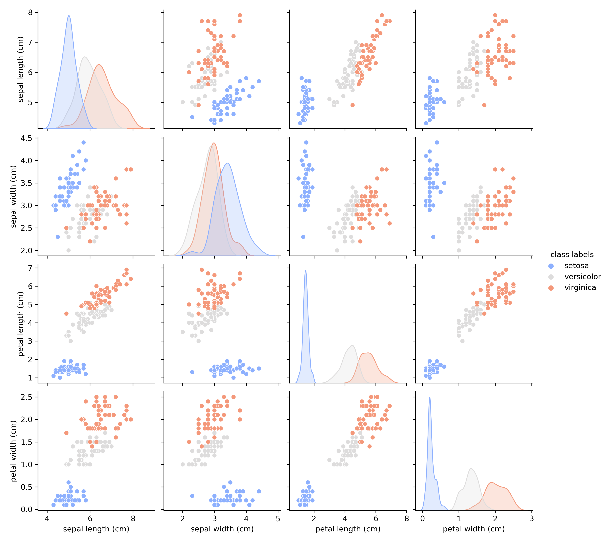 <br> <br>

- Used **Random Forest**: an ensemble learning algorithm to fit the model. It worked with 100% accuracy in training set, 
96% in Cross-validation and again 100% in test set. <br> <br>

     <br> <br>
    
    Also, told **ChatGpt** to generate random array for the model and tested, well it predicted accurately !! <br> <br>

But I think I just made the things little bit complex, when it can be done comparatively easily. Easy in a sense that I could
have tried other algorithm which are lesser complex as well as cheaper when it comes to bigger problems. But anyway, it was 
just a try !! So, that's fine !! I'll try to build a web interface and deploy this project using flask with some required 
changes. That's all for today !!

___

## Day 15

Deployed the project **Iris FLower Classification** using **Flask**. For web interface, used **HTML** and **CSS**. Below
are some of the screenshots of the interface and results based on inputs:
<br> <br>
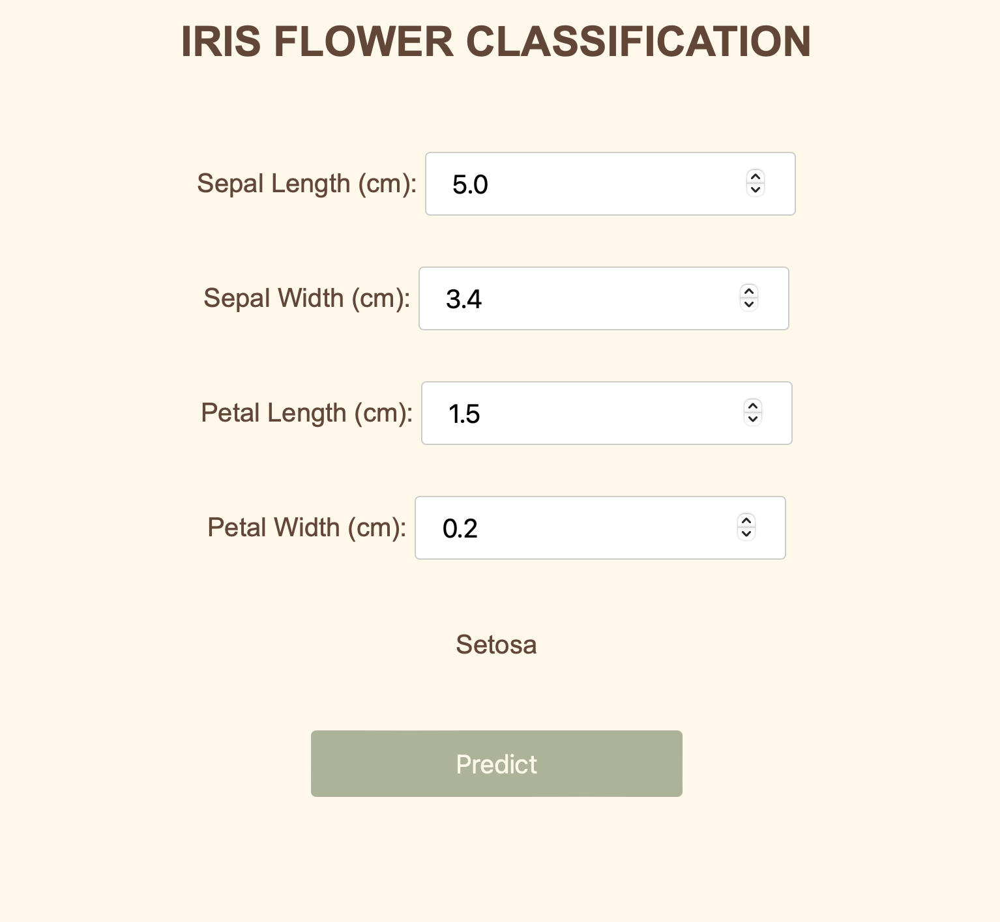 <br> <br>
 <br> <br>

<br> <br>

Visit the full project folder here: [Iris Flower Classification](https://github.com/iamshishirbhattarai/Machine-Learning/tree/main/Iris%20Flower%20Classification)

___

## Day 16

I started learning about **Unsupervised Learning** from the book. I focused on one of the clustering algorithms : **K-Means**.
The learnings are summarised in the following points:
<br> <br>
- **Unsupervised learning** finds patterns in data. The dataset provided is unlabeled. The various tasks of **Unsupervised
Learning** are **Clustering**, **Anomaly Detection**, **Density Estimation**, etc.
<br> <br>
- **Clustering**  is the task of identifying similar instances and assigning them to clusters, or groups of similar
instances. Some of the popular **Clustering** algorithms are **K-means, DBSCAN, Hierarchical Clustering**, etc. The clustering
has wide variety of applications including **Customer Segmentation**, **Data analysis**, **Dimensionality Reduction**, 
**Feature Engineering**, **Anomaly Detection**, **Semi-Supervised Learning**, **Search Engines** and **Image Segmentation**.
<br> <br>
- Today I specifically learnt about **K-means**. It is one of the simple algorithm that clusters the instances with similar
characteristics. The algorithm follows the following key steps: <br> <br>
     **i.** A random cluster center is generated for each of the clusters. <br> <br>
     **ii.** The distance to these cluster centers is computed for each point to assign to the closest cluster. <br> <br>
     **iii.** The cluster centers are recomputed. <br> <br>
     **iv.** This iteration of assigning points to the recomputed cluster centers is performed a predefined numbers
            of times.
<br> <br>
- Implemented **Kmeans** using Scikit-Learn. <br> <br>
    
    ```python
    from sklearn.cluster import KMeans
    from sklearn.datasets import make_blobs
    import numpy as np
    
    blob_centers = np.array([[ 0.2,  2.3], [-1.5 ,  2.3], [-2.8,  1.8],
                             [-2.8,  2.8], [-2.8,  1.3]])
    blob_std = np.array([0.4, 0.3, 0.1, 0.1, 0.1])
    X, y = make_blobs(n_samples=2000, centers=blob_centers, cluster_std=blob_std,
                      random_state=7)
    
    k = 5
    kmeans = KMeans(n_clusters=k, n_init=10, random_state=42)
    y_pred = kmeans.fit_predict(X)
    plt.scatter(X[:,0], X[:,1], c=y, s=1)
    plt.grid()
    plt.show()
    ```
  <br> <br>

  

___

## Day 17

Continued reading about **Clustering Algorithms**. Today I thought of taking the related course from **DataCamp** and 
took a course on **Clustering Analysis in Python** In this course, I was first introduced to **Hierarchical Clustering**
and then **Kmeans**. Let us go a little bit deeper in both of them

- **Hierarchical clustering** is a method of cluster analysis in data mining that creates a hierarchical representation
of the clusters in a dataset. I implemented this clustering using _Scipy_. Learnt to create a distance matrix using _linkage_
and learnt about various methods that we can use within _linkage_. After that, created cluster labels with _fcluster_
and then visualized the clusters using both _Seaborn_ and _matplotlib_ but found _seaborn_ more effective as well as
easier. <br> <br>
     <br> <br>
     <br> <br>
- Learnt about a technique to find the number of clusters in **Hierarchical Clustering** known as **Dendrogram**. It is a 
branching diagram that demonstrates how each cluster is composed by branching out into its child nodes. It helps in showing
progressions as clusters are merged. <br> <br>
    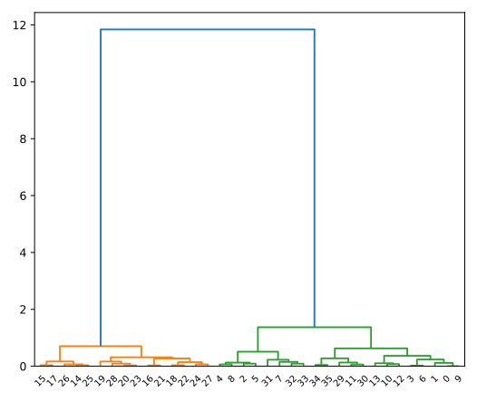 <br> <br>
By the above dendrogram, we can have some idea about number of clusters and can be chosen as 2.
<br> <br>
- Limitation of **Hierarchical Clustering** is that there is quadratic increase of runtime as data points increases. So, 
it's not feasible for large dataset. <br> <br>
- **K-means** overcomes the limitation of **Hierarchical Clustering** i.e. it runs significantly faster on larger datasets.
Yesterday I did implement the algorithm with the help of _Scikit-Learn_. Today since the course was designed on _Scipy_,
I got introduced with the syntax. Generated cluster centers with _Kmeans()_ and cluster labels with _vq()_.
<br> <br>
    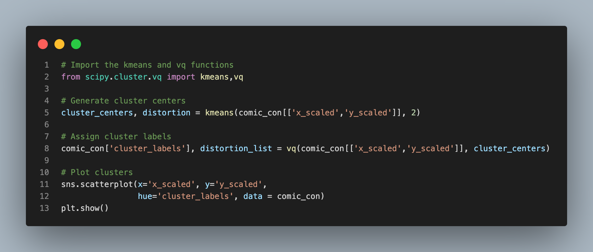 <br> <br>
    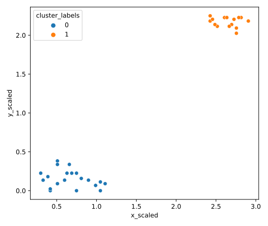 <br> <br>
- There are many methods to determine the number of clusters in **Kmeans**. But none of them are absolute method to find 
the right numbers of clusters. Today I applied **elbow method** to detect number of clusters. Distortion decreases with an
increasing number of clusters i.e. becomes zero when no. of clusters = no. of points. So, **Elbow Plot** is a line plot
between cluster centers and distortion. However, this only gives an indication of optimal K and doesn't
always pinpoint how many k (no. of clusters). <br> <br>
     <br> <br>
    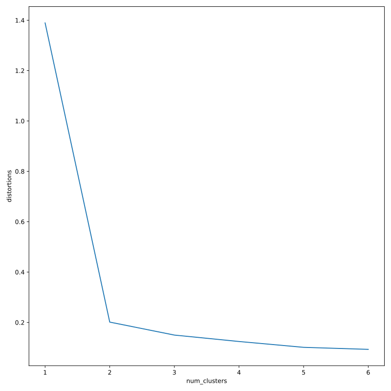 <br> <br>
With the above plot, we can take no. of clusters as 2. There is another method known as _silhouette_ which we will explore
tomorrow. <br> <br>
- There are few limitations of **kmeans**. Finding the right number of clusters, impact of seeds and biased towards equal
clusters are some of them. 
    
___ 

## Day 18

Today firstly I completed **Cluster Analysis In Python** course from **DataCamp**. Only the last chapter was remained where
I simply learnt about real world implementation of clustering. I performed **Clustering** to 
find the dominant colors in image and also performed Document clustering that involves cleaning data before processing,
determining the importance of the terms in a document (in TF-IDF matrix), clustering of the TF-IDF matrix and finding top
documents, terms in each cluster. Also performed some basic checks, visualized and found top items in clusters while dealing 
with multiple features clustering. <br> <br>
After completing the course, I came back to the book and continued where I left off. Summarizing my learnings from the book
in the following points: <br> <br>
- As promised, learnt about _silhouette coefficient_. The **silhouette coefficient** is a measure used to evaluate the 
quality of clusters in a clustering algorithm, such as K-means. It quantifies how well each data point fits within its 
assigned cluster compared to other clusters. The silhouette coefficient combines both cohesion (how close the points in
a cluster are) and separation (how distinct or far away a cluster is from other clusters). Applied **Silhouette Coefficient**
to find the optimal numbers of clusters in _Scikit Learn_. <br> <br>
     <br> <br>
     <br> <br>

As we can clearly see from the above figure that **at K=4**, the Silhouette Coefficient is higher. A coefficient close to +1 
means that the instance is well inside its own cluster and far from other clusters, while a coefficient close to 0 means 
that it is close to a cluster boundary; finally, a coefficient close to –1 means that the instance may have been assigned 
to the wrong cluster. So, **K=4** might be the right option. However, **K=5** is also pretty good, so it's better to apply
and choose the better result at the end. <br> <br>
- Performed **Image Segmentation** using Clustering. It is the task of partitioning an image into multiple segments. Here, 
I did color segmentation, that generally assigns pixel with similar colors to the same segment. You can see a simple 
implementation of color segmentation below: <br> <br>

    **The Original Image:** <br> <br>
    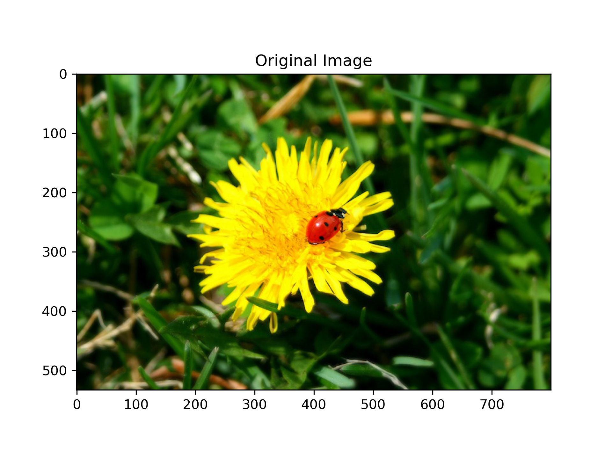 <br> <br>
    **Code Implementation:** <br> <br>
     <br> <br>
    **Segmented Image:** <br> <br>
    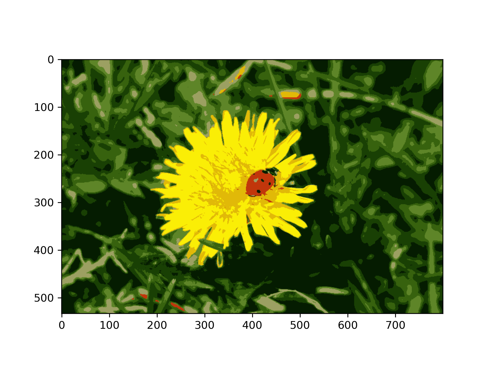 <br> <br>

___
    
    
    
    
    
  